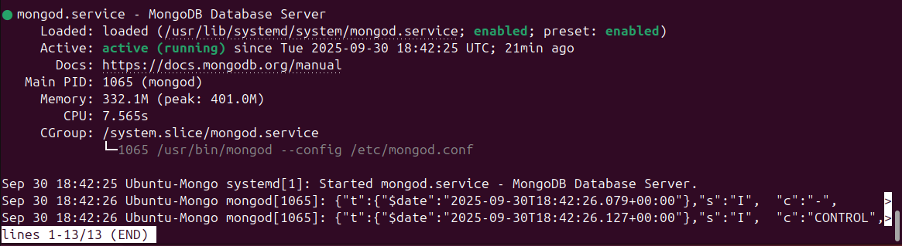
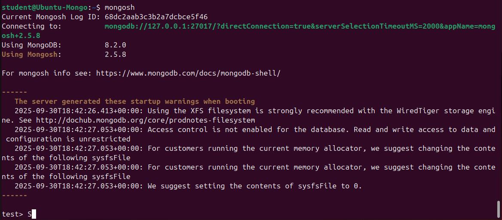
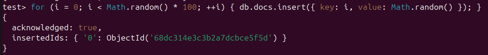
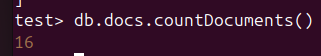
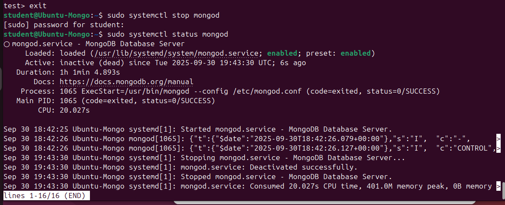

# mongodb_course
Домашнее задание 1 для курса по MongoDB

1. Разворачиваем виртуальную машину на Ubuntu 24.04.3 LTS (Noble) в VirtualBox.
2. Устанавливаем и запускаем последнюю стабильную версию MongoDB Community Server

3. Запускаем сессию Mongo

4. Создаем коллекцию со случайным количеством элементов
for ( i = 0; i < Math.random()*100; ++i ) {
   db.docs.insert( { key: i, value: Math.random() } );
}

5. Считаем количество элементов
db.docs.countDocuments()

6. Останавливаем MongoDB
sudo systemctl stop mongod

