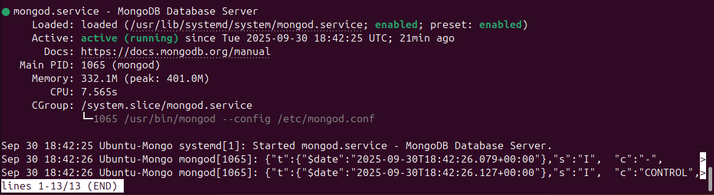
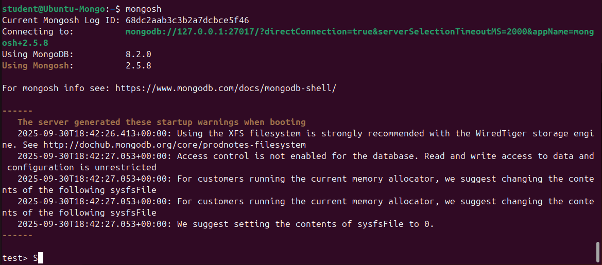
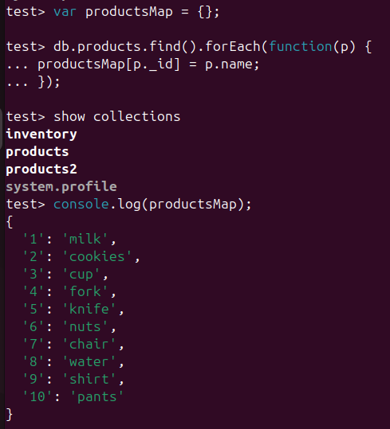
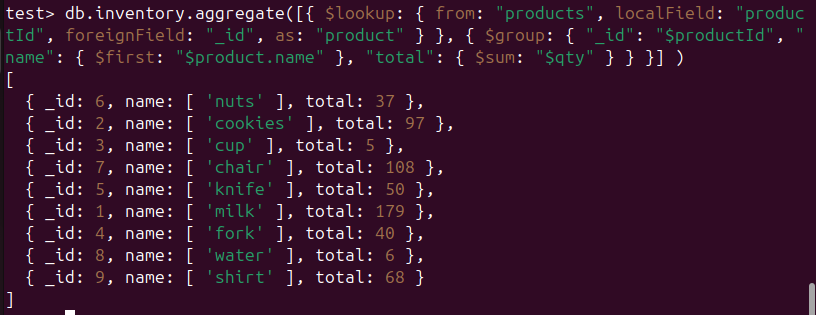

# mongodb_course
Домашнее задание 2 для курса по MongoDB

1. Разворачиваем виртуальную машину на Ubuntu 24.04.3 LTS (Noble) в VirtualBox.
2. Устанавливаем и запускаем MongoDB Community Server



3. Запускаем сессию Mongo



4. Создаем две коллекции  
   товары - 11 наименований:
```js
db.products.insertMany([
{ _id: 1, name: "milk", type: "food" },
{ _id: 2, name: "cookies", type: "food" },
{ _id: 3, name: "cup", type: "tableware" },
{ _id: 4, name: "fork", type: "tableware" },
{ _id: 5, name: "knife", type: "tableware" },
{ _id: 7, name: "chair", type: "furniture" },
{ _id: 6, name: "nuts", type: "food" },
{ _id: 8, name: "water", type: "food" },
{ _id: 9, name: "shirt", type: "clothes" },
{ _id: 10, name: "pants", type: "clothes" }])
```


   склады с наличием товаров
```js
db.inventory.insertMany([
{ productId: 7, warehouse: {id: 1, name: "first"}, qty: 15 },
{ productId: 5, warehouse: {id: 3, name: "third"}, qty: 32 },
{ productId: 3, warehouse: {id: 2, name: "second"}, qty: 5 },
{ productId: 5, warehouse: {id: 4, name: "fourth"}, qty: 18 },
{ productId: 2, warehouse: {id: 1, name: "first"}, qty: 6 },
{ productId: 7, warehouse: {id: 3, name: "third"}, qty: 93 },
{ productId: 2, warehouse: {id: 3, name: "third"}, qty: 79 },
{ productId: 1, warehouse: {id: 2, name: "second"}, qty: 17 },
{ productId: 1, warehouse: {id: 4, name: "fourth"}, qty: 162 },
{ productId: 4, warehouse: {id: 3, name: "third"}, qty: 40 },
{ productId: 8, warehouse: {id: 1, name: "first"}, qty: 6 },
{ productId: 2, warehouse: {id: 2, name: "second"}, qty: 12 },
{ productId: 6, warehouse: {id: 3, name: "third"}, qty: 37 },
{ productId: 6, warehouse: {id: 2, name: "second"}, qty: 0 },
{ productId: 9, warehouse: {id: 3, name: "third"}, qty: 68 }])
```


5. Подсчет количества товаров по наименованию (сумма с разных складов)
   через Map Reduce
```js
var productsMap = {};
db.products.find().forEach(function(p) {
  productsMap[p._id] = p.name;
});
```


```js
var mapFunction = function() {
  emit(this.productId, { name: productsMap[this.productId], qty: this.qty });
};

var reduceFunction = function(key, values) {
  var total = 0;
  var name = "";
  values.forEach(function(v) {
    total += v.qty;
    name = name || v.name;
  });
  return { name: name, qty: total };
};

db.inventory.mapReduce(
  mapFunction,
  reduceFunction,
  {
    out: "stock_totals",
    scope: { productsMap: productsMap }
  }
);
```


6. Подсчет количества товаров по наименованию (сумма с разных складов)
   через Aggregation Framework
```js
db.inventory.aggregate([
  { $lookup: {
      from: "products",
	  localField: "productId",
	  foreignField: "_id",
	  as: "product"
    }
  },
  { $group: {
      _id: "$productId",
	  name: { $first: "$product.name" },
	  total: { $sum: "$qty" }
	}
  }
])
```


7. Останавливаем MongoDB  
   sudo systemctl stop mongod


