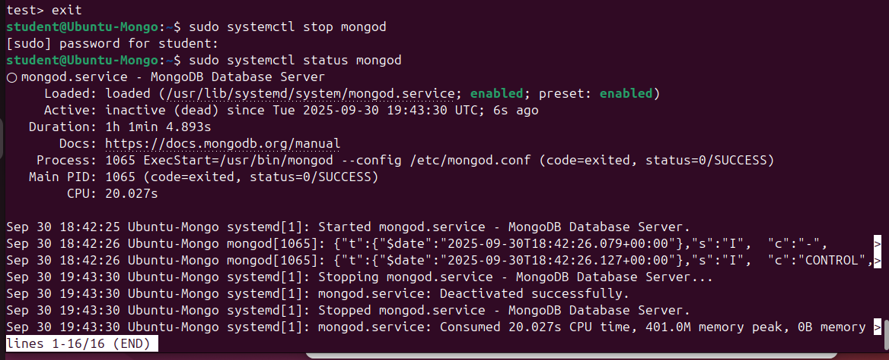

# mongodb_course
Домашнее задание 3 для курса по MongoDB

1. Разворачиваем виртуальную машину на Ubuntu 24.04.3 LTS (Noble) в VirtualBox.
2. Устанавливаем и запускаем MongoDB Community Server


3. Запускаем сессию Mongo


4. Создаем коллекцию товаров с их характеристиками
```js
db.products2.insertMany([
{ _id: 1, item: {name: "milk", sku: "111"}, type: "food", price: 110.99, qty: 89, tags: [ "A", "B", "C" ] },
{ _id: 2, item: {name: "cookies", sku: "112"}, type: "food", price: 134.49, qty: 20, tags: [ "A", "C" ] },
{ _id: 3, item: {name: "cup", sku: "135"}, type: "tableware", price: 250.00, qty: 54, tags: [ "B", "C" ] },
{ _id: 4, item: {name: "fork", sku: "136"}, type: "tableware", price: 200.01, qty: 76, tags: [ "A" ] },
{ _id: 5, item: {name: "knife", sku: "139"}, type: "tableware", price: 469.50, qty: 14, tags: [ "B" ] },
{ _id: 6, item: {name: "chair", sku: "408"}, type: "furniture", price: 3900.00, qty: 43, tags: [ "A", "B" ] },
{ _id: 7, item: {name: "nuts", sku: "059"}, type: "food", price: 347.30, qty: 15, tags: [ "A", "B", "C" ] },
{ _id: 8, item: {name: "water", sku: "173"}, type: "food", price: 63.00, qty: 267, tags: [ "B" ] },
{ _id: 9, item: {name: "shirt", sku: "826"}, type: "clothes", price: 1199.00, qty: 24, tags: [ "C" ] },
{ _id: 10, item: {name: "pants", sku: "833"}, type: "clothes", price: 2100.00, qty: 21, tags: [ "B", "C" ] },
{ _id: 11, item: {name: "chocolate", sku: "186"}, type: "food", price: 150.39, qty: 32, tags: [ "B", "A" ] },
{ _id: 12, item: {name: "spoon", sku: "157"}, type: "tableware", price: 159.99, qty: 104, tags: [ "B", "C" ] },
{ _id: 13, item: {name: "dog food", sku: "526"}, type: "pets", price: 890.00, qty: 65, tags: [ "A", "C" ] },
{ _id: 14, item: {name: "dog toy", sku: "508"}, type: "pets", price: 245.00, qty: 8, tags: [ "C" ] },
{ _id: 15, item: {name: "notebook", sku: "203"}, type: "stationery", price: 43.60, qty: 53, tags: [ "A" ] },
{ _id: 16, item: {name: "pencil", sku: "294"}, type: "stationery", price: 25.90, qty: 72, tags: [ "B", "C" ] },
{ _id: 17, item: {name: "pen", sku: "261"}, type: "stationery", price: 40.50, qty: 165, tags: [ "A", "B", "C" ] },
{ _id: 18, item: {name: "doll", sku: "354"}, type: "kids", price: 630.00, qty: 47, tags: [ "A", "B", "C" ] },
{ _id: 19, item: {name: "nutella", sku: "182"}, type: "food", price: 350.40, qty: 38, tags: [ "A", "C" ] },
{ _id: 20, item: {name: "hoodie", sku: "825"}, type: "clothes", price: 2600.00, qty: 93, tags: [ "C" ] }
])
```

5. Создаем wildcard text индекс и получаем индексы коллекции
```js
db.products2.createIndex({"$**": "text"})
db.products2.getIndexes()
```


6. Делаем поиск по текстовым полям    
Возвращается 1 документ:  


С анализом:
```js
db.products2.explain().find({
  $text: { $search: "chocolate" }
})
```


Анализ плана запроса:
Видим, что поиск выполнился по индексу (stage = "IXSCAN"), направление обратное (direction = "backward").
Использовался индекс с именем "$**_text", который мы создали на шаге 5.

Делаем другой поиск: получаем 7 документов.  


С анализом:
```js
db.products2.explain().find({
  $text: { $search: "food" }
})
```


Анализ плана запроса: аналогично предыдущему текстовому поиску.

7. Останавливаем MongoDB  
   sudo systemctl stop mongod


