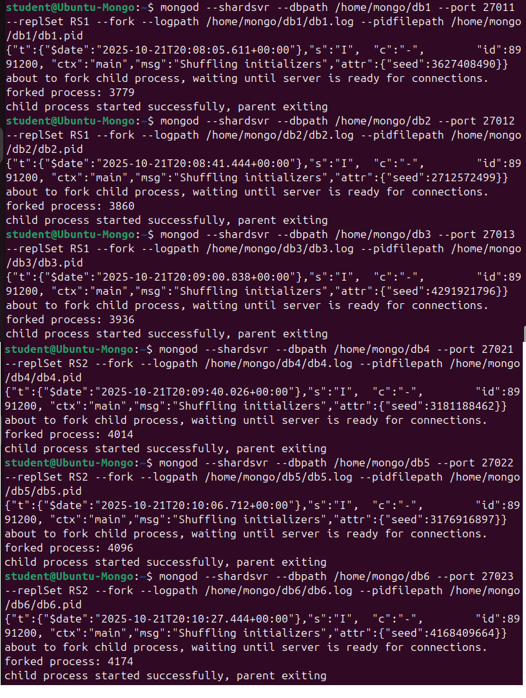

# mongodb_course
Домашнее задание 4 для курса по MongoDB

1. Разворачиваем виртуальную машину на Ubuntu 24.04.3 LTS (Noble) в VirtualBox.

2. Устанавливаем MongoDB Community Server

Строим шардированный кластер из 2 нод с репликацией (в каждой по 3 инстанса)
и с кластером конфига  
3 инстанса - 2 secondary-сервера, 1 primary или
1 secondary, 1 арбитр, 1 primary

3. Для этого сначала создаем кластер конфига
```js
-- Создаем в репликасете (3 ноды) конфиг-сервер шарда
-- имя конфиг-сета = RScfg
sudo mkdir /home/mongo && sudo mkdir /home/mongo/{dbc1,dbc2,dbc3} && sudo chmod 777 /home/mongo/{dbc1,dbc2,dbc3}
mongod --configsvr --dbpath /home/mongo/dbc1 --port 27001 --replSet RScfg --fork --logpath /home/mongo/dbc1/dbc1.log --pidfilepath /home/mongo/dbc1/dbc1.pid
mongod --configsvr --dbpath /home/mongo/dbc2 --port 27002 --replSet RScfg --fork --logpath /home/mongo/dbc2/dbc2.log --pidfilepath /home/mongo/dbc2/dbc2.pid
mongod --configsvr --dbpath /home/mongo/dbc3 --port 27003 --replSet RScfg --fork --logpath /home/mongo/dbc3/dbc3.log --pidfilepath /home/mongo/dbc3/dbc3.pid
```


Убеждаемся, что созданные процессы запущены


Заходим на первый сервер и инициализируем репликасет конфига
```js
mongosh --port 27001
rs.initiate({"_id" : "RScfg", configsvr: true, members : [{"_id" : 0, priority : 3, host : "127.0.0.1:27001"},{"_id" : 1, host : "127.0.0.1:27002"},{"_id" : 2, host : "127.0.0.1:27003"}]});
```


После выборов получаем Primary-сервер
```js
rs.status()
```


4. Создаем 2 репликасета для шардов - по 3 инстанса в каждом, итого 6 серверов  
Имена репликасетов: RS1, RS2
```js
sudo sudo mkdir /home/mongo/{db1,db2,db3,db4,db5,db6} && sudo chmod 777 /home/mongo/{db1,db2,db3,db4,db5,db6}
-- первый репликасет
mongod --shardsvr --dbpath /home/mongo/db1 --port 27011 --replSet RS1 --fork --logpath /home/mongo/db1/db1.log --pidfilepath /home/mongo/db1/db1.pid
mongod --shardsvr --dbpath /home/mongo/db2 --port 27012 --replSet RS1 --fork --logpath /home/mongo/db2/db2.log --pidfilepath /home/mongo/db2/db2.pid
mongod --shardsvr --dbpath /home/mongo/db3 --port 27013 --replSet RS1 --fork --logpath /home/mongo/db3/db3.log --pidfilepath /home/mongo/db3/db3.pid
-- второй репликасет
mongod --shardsvr --dbpath /home/mongo/db4 --port 27021 --replSet RS2 --fork --logpath /home/mongo/db4/db4.log --pidfilepath /home/mongo/db4/db4.pid
mongod --shardsvr --dbpath /home/mongo/db5 --port 27022 --replSet RS2 --fork --logpath /home/mongo/db5/db5.log --pidfilepath /home/mongo/db5/db5.pid
mongod --shardsvr --dbpath /home/mongo/db6 --port 27023 --replSet RS2 --fork --logpath /home/mongo/db6/db6.log --pidfilepath /home/mongo/db6/db6.pid
```


Убеждаемся, что созданные процессы запущены


Заходим на первый сервер и инициализируем первый репликасет с одним арбитром
```js
mongosh --port 27011
-- третий сервер здесь - это арбитр
rs.initiate({"_id" : "RS1", members : [{"_id" : 0, priority : 3, host : "127.0.0.1:27011"},{"_id" : 1, host : "127.0.0.1:27012"},{"_id" : 2, host : "127.0.0.1:27013", arbiterOnly : true}]});
```


Получаем результаты выборов. Видим, что назначены primary, secondary, arbiter
```js
rs.status()
```


Заходим на второй сервер и инициализируем второй репликасет с одним арбитром
```js
mongosh --port 27021
-- третий сервер здесь - это арбитр
rs.initiate({"_id" : "RS2", members : [{"_id" : 0, priority : 3, host : "127.0.0.1:27021"},{"_id" : 1, host : "127.0.0.1:27022"},{"_id" : 2, host 
: "127.0.0.1:27023", arbiterOnly : true}]});
```


Получаем результаты выборов
```js
rs.status()
```
Последний сервер - арбитр, первый стал primary


5. Создаем шардированный кластер
```js
-- запускаем mongos в 2 экземплярах для отказоустойчивости
mongos --configdb RScfg/127.0.0.1:27001,127.0.0.1:27002,127.0.0.1:27003 --port 27032 --fork --logpath /home/mongo/dbc1/dbs.log --pidfilepath 
/home/mongo/dbc1/dbs.pid 
mongos --configdb RScfg/127.0.0.1:27001,127.0.0.1:27002,127.0.0.1:27003 --port 27132 --fork --logpath /home/mongo/dbc1/dbs2.log --pidfilepath 
/home/mongo/dbc1/dbs2.pid
```


Подключаемся к первому экземпляру mongos, добавляем шарды
```js
mongosh --port 27032
-- задаем дефолтный write concern с одним сервером
db.adminCommand({
   "setDefaultRWConcern": 1,
   "defaultWriteConcern": {"w": 1}
})
-- добавляем шарды
sh.addShard("RS1/127.0.0.1:27011,127.0.0.1:27012,127.0.0.1:27013")
sh.addShard("RS2/127.0.0.1:27021,127.0.0.1:27022,127.0.0.1:27023")
```


Проверяем статус шардированного кластера
```js
sh.status()
```


6. Включаем шардирование для БД
```js
use bank
sh.enableSharding("bank")
```


7. Генерируем данные
```js
for (var i=0; i<30000; i++) { db.data.insertOne({name: "Random amount", amount: Math.random()*100}) }
```

Создаем индекс и шардируем по нему коллекцию
```js
db.data.createIndex({amount: 1})
sh.shardCollection("bank.data",{amount: 1})
```


8. Добавляем балансировку и проверяем, что стало 2 чанка  
Оба на одном шарде
```js
sh.splitFind( "bank.data", { "amount": "50" } )
sh.status()
```


9. Загружаем большую коллекцию stocks.zip
```js
mongorestore --port 27032 values.bson
```
На этом месте пока неудача, в первый раз архив не распаковался.
Во второй раз получаю ошибку:


И память нагружается довольно сильно:
