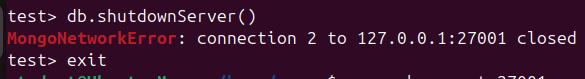

# mongodb_course
Домашнее задание 5 для курса по MongoDB

1. Разворачиваем виртуальную машину на Ubuntu 24.04.3 LTS (Noble) в VirtualBox.

2. Устанавливаем MongoDB Community Server

3. Запускаем Mongo и стартуем Mongo shell
```js
sudo mkdir /home/mongo/db1 && sudo chmod 777 /home/mongo/db1 && mongod --dbpath /home/mongo/db1 --port 27001 --fork --logpath /home/mongo/db1/db1.log --pidfilepath /home/mongo/db1/db1.pid
mongosh --port 27001
```


4. Настраиваем аутентификацию
```js
-- создаем алиас БД
db1 = db.getSiblingDB("admin")
-- создаем роль со всеми правами на любой ресурс
db1.createRole(
    {      
     role: "superRoot",      
     privileges:[
        { resource: {anyResource:true}, actions: ["anyAction"]}
     ],      
     roles:[] 
    }
)

-- создаем первого пользователя и присваиваем ему эту роль
db1.createUser({      
     user: "companyDBA",      
     pwd: "W9d6f21rm",      
     roles: ["superRoot"] 
})

-- создаем второго пользователя со стандартной ролью readWrite только на БД 
db1.createUser({      
     user: "employee",      
     pwd: "xYn78wM3k",      
     roles: [{role: "readWrite",db: "test2"}] 
})

-- получаем пользователей и роли
use admin
db.system.users.find()
db.system.roles.find()
-- останавливаем сервер
db.shutdownServer()
```


5. Запускаем сервер с аутентификацией
```js
mongod --dbpath /home/mongo/db1 --port 27001 --auth --fork --logpath /home/mongo/db1/db1.log --pidfilepath /home/mongo/db1/db1.pid
```

6. Логинимся под первым пользователем
```js
-- вводим неправильный пароль
mongosh --port 27001 -u companyDBA -p Tr*123 --authenticationDatabase "admin"

-- вводим правильный пароль
mongosh --port 27001 -u companyDBA -p W9d6f21rm --authenticationDatabase "admin"
```


```js
-- проверяем права
db.test.insertOne( { name : "John", surname : "Smith" } )
show collections
db.test.find()
```


7. Логинимся под вторым пользователем и проверяем авторизацию
Кстати, получилось сделать shutdown не из БД admin:


```js
mongosh --port 27001 -u employee -p xYn78wM3k --authenticationDatabase "admin"
-- у пользователя права только на чтение/запись в БД test2
-- пытаемся сделать чтение или запись в БД test, запрещено
-- добавляем запись в БД test2, можем получить коллекции и прочитать документы в коллекции
```


8. Заходим без аутентификации и настраиваем валидацию
```js
mongod --dbpath /home/mongo/db1 --port 27001 --fork --logpath /home/mongo/db1/db1.log --pidfilepath /home/mongo/db1/db1.pid

-- создаем пустую коллекцию с валидатором
db.createCollection("movies" , {
   validator: { $jsonSchema: {
      bsonType: "object",
      required: [ "title", "year", "cast", "extract", "thumbnail" ],
      properties: {
         title: {
            bsonType: "string",
            description: "required and must be a string" },
         year: {
            bsonType: "int",
			minimum: 1900,
            maximum: 2025,
            description: "the value must be in the range 1900-2025" },
         cast: {
            bsonType: ["string"],
            description: "required and must be an array" },
         genres: {
            bsonType: ["string"],
            description: "required and must be an array" },
         href: {
            bsonType: "string",
            description: "required and must be a string" },
		 extract: {
            bsonType: "string",
            description: "required and must be a string" },
		 thumbnail: {
            bsonType: "string",
            description: "required and must be a string" },
		 thumbnail_width: {
            bsonType: "int",
            description: "required and must be an integer" },
		 thumbnail_height: {
            bsonType: "int",
            description: "required and must be an integer" }
      }
   }
}})
```

9. Импортируем данные
```js
wget https://raw.githubusercontent.com/prust/wikipedia-movie-data/master/movies.json
mongoimport --port 27001 -d test -c movies --file movies.json --jsonArray --upsert
```
Документ в импортируемой коллекции не прошел валидацию:


Удаляем коллекцию и создаем новый валидатор (или можно было модифицировать через runCommand)
```js
db.movies.drop()
db.createCollection("movies" , {
   validator: { $jsonSchema: {
      bsonType: "object",
      required: [ "title", "year", "cast", "genres" ],
      properties: {
         title: {
            bsonType: "string",
            description: "required and must be a string" },
         year: {
            bsonType: "int",
			minimum: 1900,
            maximum: 2025,
            description: "the value must be in the range 1900-2025" },
         cast: {
            bsonType: "array",
			items: { bsonType: "string" },
            description: "required and must be an array" },
         genres: {
            bsonType: "array",
			items: { bsonType: "string" },
            description: "required and must be an array" },
         href: {
            bsonType: ["string", "null"],
            description: "required and must be a string" },
		 extract: {
            bsonType: "string",
            description: "required and must be a string" },
		 thumbnail: {
            bsonType: "string",
            description: "required and must be a string" },
		 thumbnail_width: {
            bsonType: "int",
            description: "required and must be an integer" },
		 thumbnail_height: {
            bsonType: "int",
            description: "required and must be an integer" }
      }
   }
}})
```
Импортируем данные еще раз:
```js
mongoimport --port 27001 -d test -c movies --file movies.json --jsonArray --upsert
```
Успешно:


10. Экспортируем данные
```js
mongoexport --port 27001 -d test -c movies -o export.json
```
